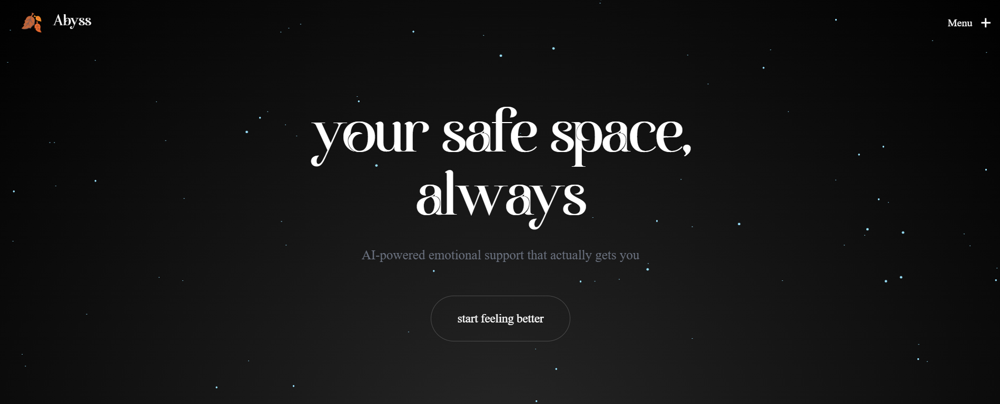

# 🌑 Abyss Therapist

<div align="center">



[](https://nextjs.org/)
[](https://react.dev/)
[](https://www.typescriptlang.org/)
[](https://firebase.google.com/)
[](https://tailwindcss.com/)
[](https://www.framer.com/motion/)
[](LICENSE)
[](https://github.com/cloudQuest7/abyss_therapist/stargazers)

A dark, immersive mental wellness platform with journaling, community support, and AI assistance.

[Live Demo](#) • [Report Bug](https://github.com/cloudQuest7/abyss_therapist/issues) • [Request Feature](https://github.com/cloudQuest7/abyss_therapist/issues)

</div>

---

## ✨ Features

- 📔 **Mood Journaling** — Track emotions with real-time streaks and patterns
- 💬 **Community Healing** — Share, react, and support anonymously
- 🤖 **AI Assistant** — Real-time wellness guidance and crisis support
- 📊 **Live Analytics** — Beautiful dashboard with mood trends and insights
- 🥚 **Easter Eggs** — Hidden developer contact portals throughout the app
- 🎨 **Dark UI** — Glassmorphism design with Framer Motion animations

---

## 🚀 Quick Start

### Prerequisites
- Node.js 18+ | npm/pnpm/yarn
- Firebase project (Firestore + Auth)

### Setup

```bash
# Clone & install
git clone https://github.com/cloudQuest7/abyss_therapist.git
cd abyss_therapist/abyss
npm install

# Configure Firebase
# Create .env.local with your Firebase credentials:
# NEXT_PUBLIC_FIREBASE_API_KEY=...
# NEXT_PUBLIC_FIREBASE_PROJECT_ID=...

# Run development server
npm run dev
```

Open [http://localhost:3000](http://localhost:3000)

---

## 🛠️ Tech Stack

**Frontend:** Next.js 16 • React 19 • TypeScript • Tailwind CSS • Framer Motion  
**Backend:** Firebase • Firestore • Cloud Functions  
**DevOps:** GitHub Actions • Vercel  

---

## 📁 Project Structure

```
abyss/
├── app/
│   ├── dashboard/        # User dashboard & features
│   ├── api/              # API routes
│   └── page.tsx          # Landing page
├── components/           # Reusable UI components
├── lib/                  # Firebase & utilities
└── public/               # Static assets
```

---

## 💬 Get in Touch

- **GitHub Issues** — [Report bugs or request features](https://github.com/cloudQuest7/abyss_therapist/issues)
- **Use Easter Eggs** — Find hidden portals to message the developer directly
- **Twitter** — [@cloudQuest7](https://twitter.com)

---

## 📝 License

MIT License — see [LICENSE](LICENSE) file

---

<div align="center">

Made with 💜 for healing

⭐ Star this repo if it helped you!

</div>

